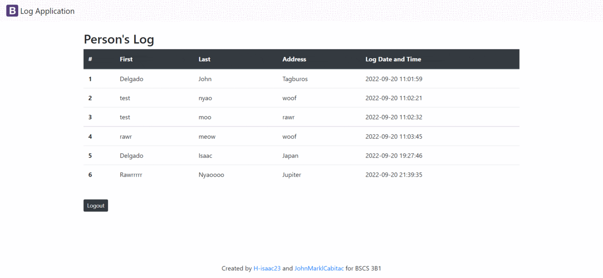

# **GUEST LEDGER** :computer: 

## *Description* 	:ledger:
    
- A guestbook is book of blank pages or in this case an online application in which visitors or guests at an event.
- this **GUEST LEDGER** is a sample application that logs the individual's personal information and the date and time he/she visits the place. 
- Users of this application can only enter information that is necessary for their arrival.
- Users cannot acces and manipulate information of other visitors/users. 
- Users with an admin account is the only one that can see and manipulate the informations of the users in this guest ledger
- The *Data Privacy Act of 2012, or RA 10173*, protects the information that users provide.
---
 
 ## _Visuals_ :eye:

---
## *Installation* :cd:
> ### *tool needed* :screwdriver:
    1. MySql woorkbench

> ### _Process_
- Using Mysql create a schema with a name same whit the **DB_NAME** in your config.php file.
- Inside, Create first table named "account" with a coloumn  (acc_id INT,  username VARCHAR(45),  password_hash VARCHAR(100),  acc_type VARCHAR(45) ).

- Create second table named "person" with a coloumn  (pid INT,  lastname VARCHAR(45),  firstname VARCHAR(100),  adrress VARCHAR(100), logdt DATETIME ).

- Using Php connect your created database with your file.
---
## *Author* :boy:

## **JOHN MARK L. CABITAC** 

## **JOHN ISAAC DELGADO**

